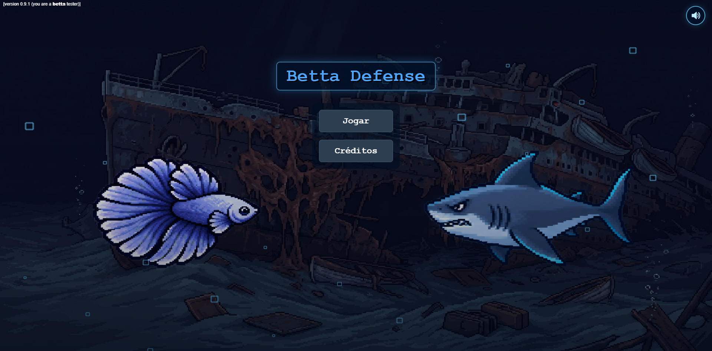
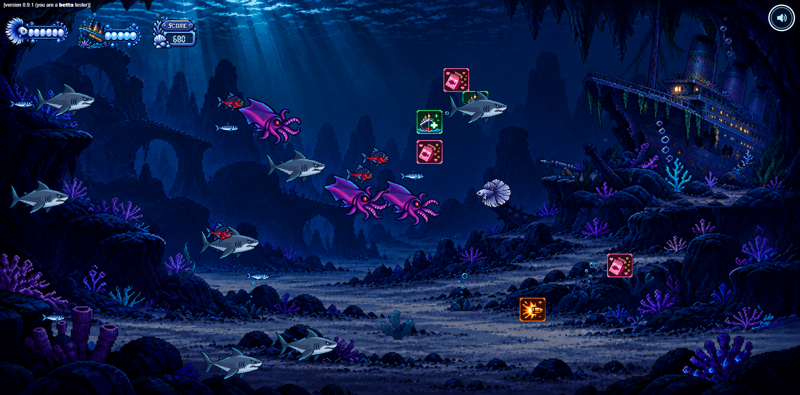
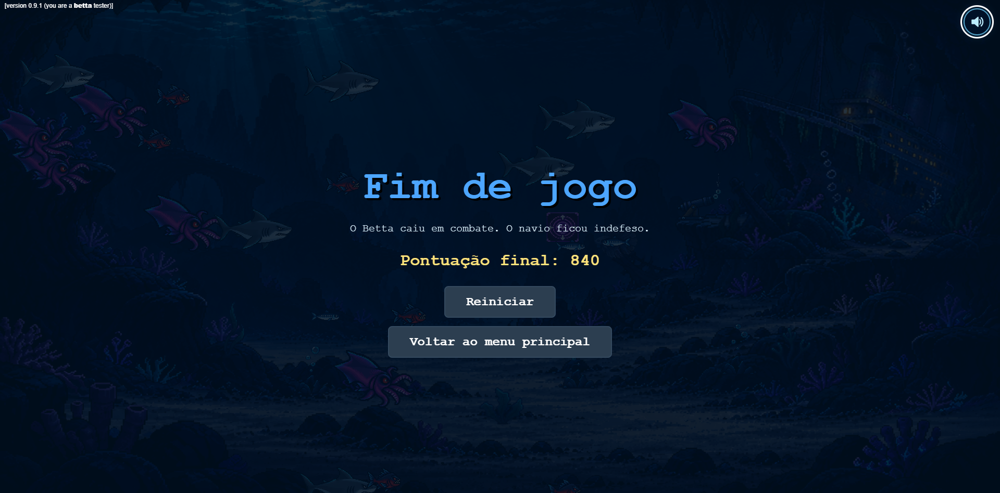

# Betta Defense

Jogo desenvolvido como trabalho acadêmico da disciplina de Computação Gráfica.

## (a) O jogo

**Betta Defense** é um jogo de defesa (*power defense*) desenvolvido com WebGL 2. O jogador controla um peixe Betta e precisa proteger o Titanic de ondas crescentes de criaturas marinhas.

O Betta se movimenta pelo cenário, dispara bolhas automaticamente contra inimigos próximos e coleta power-ups. O Titanic também ataca automaticamente e possui um golpe em área acionado pelo jogador. A partida termina quando a vida do Betta ou do navio chega a zero.

| Ação | Controle |
| --- | --- |
| Movimentar o Betta | `WASD` ou setas direcionais |
| Usar o golpe em área do Titanic | Clique do mouse |
| Ativar ou desativar o áudio | Ícone de som no canto superior direito |

Como o projeto utiliza módulos JavaScript e carrega shaders por `fetch`, ele deve ser executado por um servidor HTTP. Um exemplo é iniciar `python -m http.server 8000` na raiz do repositório e acessar `http://localhost:8000`.

## (b) Criadores

| Nome | GitHub | Contato |
| --- | --- | --- |
| João Pedro Santos | [@joopedriantos](https://github.com/joopedriantos) | [joaosilvasantos1702@gmail.com](mailto:joaosilvasantos1702@gmail.com) |
| Caio Costa | [@C4io988](https://github.com/C4io988) | [caiocosta2002@hotmail.com](mailto:caiocosta2002@hotmail.com) |

## (c) Media kit

**Menu principal**

**Partida em andamento**

**Tela de fim de jogo**

## (d) Opcionais implementados

- Menu principal animado em três camadas: fundo do Titanic, personagens em *sprite sheets* e bolhas em movimento.
- Animações direcionais do Betta e animações de movimento e ataque dos inimigos.
- Quatro tipos de inimigos, com atributos, alvos e comportamentos diferentes.
- Cinco power-ups: cadência, dano, área de ataque, reparo do casco e ração do Betta.
- HUD personalizada com vida do Betta, vida do Titanic e pontuação.
- Disparos do Betta representados por bolhas transparentes.
- Efeitos visuais e sonoros para dano e coleta de power-ups.
- Trilha sonora aleatória, transições graduais, aumento de velocidade durante partidas longas e músicas exclusivas de fim de jogo.
- Tela de Game Over com pontuação final, reinício da partida e retorno ao menu principal.
- Câmera com área virtual fixa e adaptação a diferentes proporções de tela.

## (e) Créditos

- Imagens, ilustrações e sprites criados com auxílio do [ChatGPT, da OpenAI](https://chatgpt.com/).
- Músicas e efeitos sonoros criados com [ElevenLabs](https://elevenlabs.io/).
- Código, integração WebGL e design do jogo: João Pedro Santos e Caio Costa.

Projeto produzido para fins acadêmicos.
